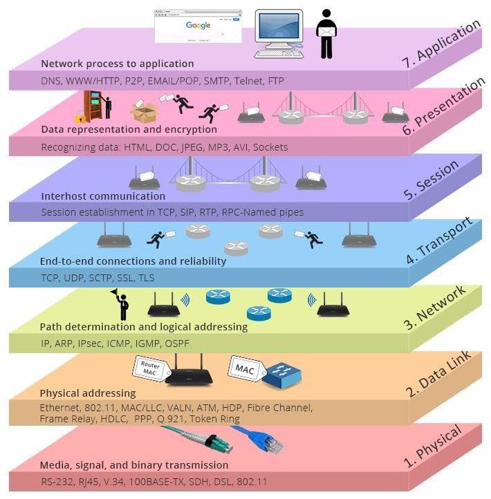

[TOC]

# Review) Creating a virtual machine

[Disks] we can create and attach a new disk up to 4.

[Management]

​	'Boot Diagnostics' off ==> much faster!

​	'Auto-shutdown' ==> manage it carefully.

------

# NETWORK BASICS

## IP Address 

인터넷의 주소 체계, v4 (32 bit)와 v6 (128bit)가 있다.

> 32 bit라는 것은 만들 수 있는 IP갯수가 42.9억라는 뜻이다.

**A Class** : 첫 번째 비트가 0으로 고정

​	<u>0</u>0000000 00000000 00000000 00000000		<u>1</u>.0.0.0 <== A클래스의 첫번째 IP

​	<u>0</u>1111111 11111111 11111111 11111111		<u>126</u>.255.255.255  <== A클래스의 마지막 IP

​	N.H.H.H	255.0.0.0

​	Network 수 $ =  2^7 - 2 = 126 $, Host 수 $ = 2^{24} - 2 = 16777214 $

> 1 octet = 8 bit  ==> 255보다 큰 숫자는 안들어가요.
>
> <0과 127은 특별하다>
>
> - 0 로 시작되는 IP: 네트워크 식별
>
> - 127 로 시작되는 IP: loop back IP. 패킷이 목적지를 찾아서 외부로 나가는 것이 아니라 내 컴퓨터로 내부로 가는 아이피.  개발자들에게 테스트 용도.

**B Class** : 첫 두 비트가 10으로 고정

​	<u>10</u>000000 00000000 00000000 00000000		128.0.0.0

​	<u>10</u>111111 11111111 11111111 11111111		191.255.255.255

​	N.N.H.H	255.255.0.0

​	Network 수 $ =  2^{14} = 16384 $, Host 수 $ = 2^{16} - 2 = 65534 $

**C Class** : 첫 세자리가 110으로 고정      

​	<u>110</u>00000 00000000 00000000 00000000		192.0.0.0  

​	<u>110</u>11111 11111111 11111111 11111111		223.255.255.255

​	N.N.N.H	255.255.255.0

​	Network 수 $ =  2^{21} = 2097152 $ , Host 수 $ =2^{8} - 2 = 254 $

======================    ↑ 목적지를 찾기위한 용도 /  ↓특수한 용도    ======================     

**D Class** 1110 멀티캐스트 데이터 전송(1: 그룹 통신)

**E Class** 1110 군사용, 예약 IP


## 데이터 전송 방식

- 유니캐스트 (1:1) ABC클래스. 자기 아이피와 목적지 아이피가 일대일로 통신

- 멀티캐스트 (1:그룹) 하나의 패킷이 여러대의 컴퓨터에 데이터 전송

- 브로드캐스트 (1:모든(라우터에서 필터)) 그 네트워크 안에 있는 모든 컴퓨터에 데이터  전송


## IP Address의 구성

 IP Adress = Network ID + Host ID

- Network ID : Network ID를 가지고 라우터를 찾아감. 네트워크를 식별. "우편번호"

  ​						ISP에서 부여. 다량의 IP를 확보. IANA로부터 부여받음.

  > ISP : Internet Service Provider
  >
  > IANA(Internet Assigned Numbers Authority)는 인터넷 할당 번호 관리기관의 약자로 IP 주소, 최상위 도메인등을 관리하는 단체이다.

- Host ID : 찾아간 Network에서 컴퓨터를 찾아감. 네트워크 내의 시스템을 식별. "번지" 컴퓨터를 찾아감.

​						네트워크 관리자가 부여


## Subnet Mask

Network ID (Network)를 식별하기 위해 사용. 첫번째 비트부터 1이 들어가는 비트까지가 Network ID 이다.


## 세팅하지 않는 IP

- Host ID의 모든 비트가 0일 때: Network을 식별할 때 사용.

- Host ID의 모든 비트가 1일 때: BroadCast 데이터 전송시 사용.

==> 항상 2개를 빼줍니다.


## Gateway IP

라우터 장비에 부여되는 IP. 내부 네트워크와 외부 네트워크의 관문.

> 라우터 = 네트워크를 분리시켜주는 장비를 말합니다.

> 자신의 IP와 Subnet Mask를 AND 연산하여 자신의 Network ID를 식별하고,
>
> 목적지 IP와 자신의 Subnet Mask를 AND 연산하여 목적지 Network ID를 식별한다
>
> 두 Network ID가 동일할 경우 Gateway 없이 통신하고 다를 경우 패킷을 Gateway에 전송


## CIDR (Classless Inter-Domain Routing)표기법(시험문제)

Subnet Mask를 10진법으로 표기하지 않고, 2진법으로 표기한다.

Class를 이용하여 IP를 분류하는 것은 IP낭비가 심하다.

> 우리회사는 50개의 IP가 필요합니다. 최적의 Subnet Mask?
>
> 11111111 11111111 11111111 11000000   ==>  $2^6 - 2 = 62$개 
>
> ip/26 << Subnet Mask 1이 들어간 비트수가 26개
>
> ip/255.255.255.192 << class로 표현.

> 우리회사는 300개의 IP가 필요합니다. 최적의 Subnet Mask?
>
> 11111111 11111111 11111110 00000000
>
> ip/23
>
> ip/255.255.254.0

> 우리회사는 2000개의 IP가 필요합니다. 최적의 Subnet Mask?
>
> 11111111 11111111 11111100 00000000
>
> ip/21
>
> ip/255.255.248.0

## Sub Network

**- ISP에서 $70.12.113.0/24$를 부여받았다. $2$개의 네트워크를 분할해서 사용.**

​	$70.12.113.00000000$			$70.12.113.0/25$

​				Network ID: 70.12.113.0​

​				Broadcast IP: 70.12.113.127​

​				Host 수: $2^7 - 2 = 126$개

​				IP 범위: 70.12.113.1​ ~ 70.12.113.126​

​	$70.12.113.10000000$			$70.12.113.128/25$

​				Network ID: 70.12.113.128​

​				Broadcast IP: 70.12.113.255​

​				Host 수: $2^7 - 2 = 126$개

​				IP 범위: 70.12.113.129 ~ 70.12.113.254​


**- ISP에서 $70.12.0.0/16$을 부여받았다. $4$개의 네트워크를 분할해서 사용.**

​	$70.12.00000000.00000000$			$70.12.0.0/1$8

​				Network ID: 70.12.0.0​

​				Broadcast IP: 70.12.63.255​

​				Host 수: $2^{14} - 2 = 16382$

​				IP 범위: 70.12.0.1​ ~ 70.12.63.254​

​	$70.12.01000000.00000000$			$70.12.64.0/18$

​				Network ID: 70.12.64.0

​				Broadcast IP: 70.12.128.255

​				Host 수: $2^{14} - 2 = 16382$

​				IP 범위: 70.12.64.1 ~ 70.12.128.254

​	$70.12.10000000.00000000$			$70.12.128.0/18$

​				Network ID: 70.12.128.0

​				Broadcast IP: 70.12.191.255

​				Host 수: $2^{14} - 2 = 16382$

​				IP 범위: 70.12.128.1 ~ 70.12.191.254

​	$70.12.11000000.00000000$			$70.12.192.0/18$

​				Network ID: 70.12.192.0

​				Broadcast IP: 70.12.255.255​

​				Host 수: $2^{14} - 2 = 16382$

​				IP 범위: 70.12.192.1 ~ 70.12.255.254

## Public IP & Private IP

Public IP: 라우팅되는 IP

Private IP: 라우팅되지 않는 IP

​	사용목적1. 보안. 내부망에서만 쓰임.

​	사용목적2. **NAT**. 사설 IP의 패킷을 라우터에 보내면 라우터에서  받아서 공인아이피로 변환해서 보내고.

​								라우터로 들어온 패킷은 다시 사설 아이피로 바꾸어 들여보낸다.

​								패킷의 Source IP ==> Public IP 로 변환해서 인터넷망으로 전달

​			A 10.0.0.0 ~ 10.255.255.255

​			B 172.16.0.0 ~ 172.31.255.255

​			C 192.168.0.0 ~ 192.168.255.255

Azure의 VM의 네트워크는 Private IP로 되어있다.


## Port

데이터가 전송되는 통로를 말한다. (0 ~ 65,536)

​	잘 알려진 포트 : 0~1023

​		**TCP** : Transmission Control Protocol. 신뢰성 있는 전송, 3-way Handshake, 전송속도가 느리다.

​		**UDP** : User Datagram Protocol. 신뢰성 없는 전송, 전송속도가 빠르다.

> 3 way Handshake란 데이터가 잘 전송되었는지 3번 확인한다는 것이다.

c:\Windows\system32\drivers\etc\services 에 써있다.

<예약되어있는 서비스 목록>  알고 있어야 함.

TCP 21 : FTP

TCP 22 : SSH

TCP 23 : Telnet

TCP 25 : SMTP

TCP 53 : DNS 영역전송

> 1차 DNS가 Fail했을 때, 2차 DNS에서 서비스를 할 수 있도록 한다.

UDP 53 : DNS 이름 풀이

> FQDN을 IP로 변환하는 과정을 이름풀이라 한다.

UDP 67, 68 : DHCP

TCP 80 : HTTP

TCP 1433 : MS-SQL

TCP 3389 : RDP


**Port 살펴보기**

`>netstat -na`


**방화벽 살펴보기**

실행창에 다음을 입력 : wf.msc(고급 방화벽), firewall.cpl(기본 방화벽)


**스위치와 허브**

요즘에는 스위치를 주로 사용하고, 허브는 잘 사용하지 않는다.

허브는 들어오면 무조건 다 뿌려주고,

스위치는 해당 포트로 데이타를 연결해서 던져준다. 지능적.


**목적지 IP로 가는 데 거치는 라우터들을 보는 방법**

```python
> tracert www.google.com
```

## OSI 7 Layer




## VPN

인터넷 망을 통해 외부 네트워크에서 회사망을 접속

터널링 프로토콜 (아래로 갈수록 최신)

​	PPTP : 옛날. 보안에 취약.

​	L2TP

​	SSTP : TCP 443 하나 열어주면 사용할 수 있다. <== SSH

​	IKEv2 : 모바일로 회사망에 무선으로 접속을 하면, 잠시 끊기는 경우가 있다. 그러면 새로 접속을 해야하는데, 				IKEv2는 서버에서 클라이언트로 세션을 새롭게 맺어서새로 로그온하지 않아도 되도록 함.


## DNS

```python
> ping www.google.com
> ipconfig /displaydns
```

도메인 만드는 곳:

www.internic.org : 전세계도메인을 관리


