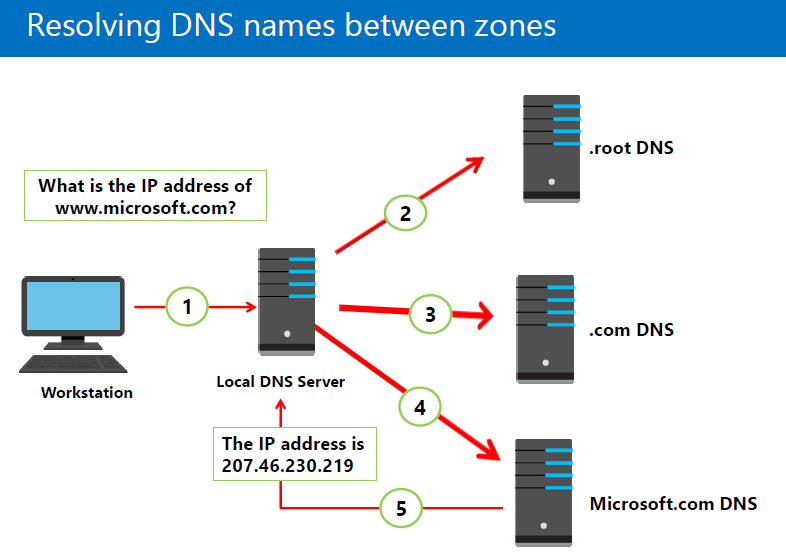
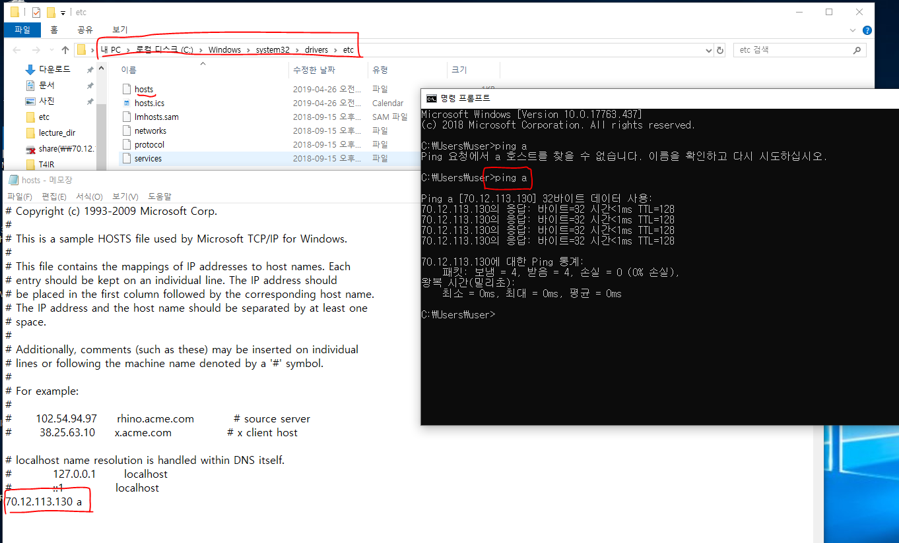

2019/04/26 (금)

------

## Resolving DNS names between zones

인터넷망의 DNS에 물어봐서 IP주소를 알려줍니다.

1. 클라이언트가 Local DNS 서버에 물어봅니다.

   자기 TCP IP에 DNS가 저장되어 있습니다. DNS 서버는 루트서버 주소를 알고 있습니다.  

   > Cache
   >
   > - 장점: 서버의 부하가 줄어듭니다. 빠르게 접근할 수 있습니다.
   >
   > - 단점: 부정확한 값을 가져올 수 있습니다.서버에서 직접 가져오기 않기 때문에, 서버의 내용이 변경되거나 했을 때 그 내용을 받아오지 못한다.에서 뭔가 바꼈다거나 해도 몰라서, 부정확한 값을 가져올 수 있습니다.

2.  .root DNS서버는 전 세계 13대가 있습니다.

   .com, .kr 등 최상위 도메인 주소를 가지고 있습니다.

3. .com DNS 서버로 갑니다.

4. Microsoft.com DNS 서버로 갑니다. 회사 이름에 대한 DNS의 위치를 가지고 있습니다.

5. 클라이언트에게 IP 주소를 알려줍니다.

## DNS Cache

​		C:\Windows\system32\drivers\etc\hosts

초창기에는 호스트파일을 썼다.

​		ipconfig /displaydns		<==DNS Cache 확인

​		ipconfig /flushdns			<== DNS Cache 삭제

## Zone

DNS DataBase (multicampus.co.kr)

레코드 <== Zone 내에서 역할을 수행하는 것들입니다.

레코드의 종류

​	A : 호스트 이름을 IP로 변환해주는 레코드

​	CNAME : 호스트 이름을 다른 호스트 이름으로 변환해주는 레코드

​	MX : 메일서버를 지정해주는 레코드

​	SRV : 서비스의 위치를 지정해주는 레코드

## Virtual Network

point to sight VPN 

Service endpoints : 브이넷을 통해 받을 수있는 실제 서비스

## Network Load Balancer

3_tier

web tier					app tier					SQL tier

이렇게 분리된 서버에 사용자가 접근할 때, 부하를 분산해줍니다.

- vnet 앞에 network security group이 붙습니다.
- network security group 은 방화벽입니다.

