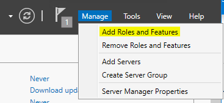

# Azure Web App

[TOC]

# PART 1. IaaS환경에서 만들기

## 1. IaaS SQL 배포

Create a resource > Databases > SQL Server 2017 Enterprise Windows Server 2016

> Basics
>
> ​	Resource group : RG-0502
>
> ​	Virtual machine name : SQL01
>
> ​	Size : A4_v2 Standard
>
> ​		기본적으로 Standard DS13 v2 정도는 써야하지만,
>
> ​		돈이 많이 나오니까 실습에서는 작은 사이즈를 사용합니다.
>
> ​	INBOUND PORT RULES
>
> ​		Allow selected ports 클릭.
>
> ​		HTTP, HTTPS, RDP를 엽니다.
>
> ​			3389는 nsg에서 열어주는 포트입니다..
>
> Management
>
> ​	Boot diagnostics : off
>
> SQL Server settings
>
> ​	SQL Authentication : Enable
>
> ​	Login name : Student
>
> ​	Password : Pa55w.rd1234


**IaaS 환경의 Web Service를 이용하려면 '서버 장비 구매'는 MS가, 'OS 설치', 'IIS 설치'는 내가.**


## 2. 리눅스 배포

Create a resource > CentOS 7.6

> Basics
>
> ​	Resource group : RG-0502-02
>
> ​	Virtual machine name : Linux
>
> ​	Port: HTTP, HTTPS, SSH 열기
>
> Management
>
> ​	Boot diagnostics off


3. FTP 구성해보기

RG-0502> SQL01-nsg > Inbound security rules> Add

> Source : Any ==client
>
> Destination port ranges : 21
>
> Protocol : TCP								"TCP 21 port  만 allow 해준다."
>
> ​															"FTP는 21번이 기본포트다."
>
> Priority : 360
>
> Name : Port_21


==> 리눅스 서버에서도 반복


## 3. Window Server에서

**Window Server 접속**

DNS 설정 후 > 접속 :  `mstsc /v: kyi-ws2016.eastus.cloudapp.azure.com`


**Windows Server 2016**

- IIS(Internet Information Service) 설치

  - Web Server (TCP80)

    > - 웹페이지를 Client에게 전송합니다.
    > - 웹브라우저들은 기본적으로 80번 포트를 사용합니다.

  - FTP Server (TCP21)

    

> **웹 페이지**
>
> - 정적 페이지
>   - html
>   - 코드를 클라이언트 브라우저가 해석합니다.
> - 동적 페이지
>   -  asp, .net, java, nodejs
>   - 코드를 서버에서 해석하고, 해석된 결과를 Client에게 보내줍니다.
>   - 데이터베이스와 연동이 가능하고, 응답형 페이지를 만듭니다.

**IIS 설치하기**

Server Manager > Manage > Add Roles and Features

> Role vs. Feature
>
> Role - 서버서비스 (16), Web Server(IIS)
>
> Feature - 기능 (35)



IIS에 체크


리부팅 체크 > 끝!

Tools > Internet Information Services Manager


Web Server Home Directory

​	C:\inetpub\wwwroot


Default Document(기본 문서)


index.htm 파일 수정하기


결과


## 4. Linux 서버에서

**Linux (CentOS 7.6)**

- **APM (<u>A</u>pache, <u>P</u>HP, <u>M</u>ySQL(MariaDB))**
- **서비스 자동 등록 (부팅할 때 이 서비스를 자동으로 시작해라)**
- **서비스 시작**
- **방화벽 오픈**


```javascript
# Portal에서 DNS 구성 후, VM 접속
$ ssh Student@kyi-linux.eastus.cloudapp.azure.com
$ ping 8.8.8.8  #체크

# 1. APM 설치
$ sudo yum install httpd php php-mysql php-pod php-gd php-mbstring mariadb mariadb-server
$ rpm -qa httpd #설치되었는지 확인하기
$ rpm -qa php
$ rpm -qa mariadb
$ rpm -qa mariadb-server

# 2. 서비스 자동등록
$ sudo systemctl enable httpd
$ sudo systemctl enable mariadb

# 3. 서비스 시작
$ sudo systemctl start httpd
$ sudo systemctl start mariadb

# 잘 되었나 확인
$ sudo systemctl status httpd
$ sudo systemctl status mariadb
$ rpm -qm httpd php mariadb mariadb-server

# 방화벽 체크
$ sudo systemctl status firewalld

# 4. 방화벽 시작
$ sudo systemctl enable firewalld
$ sudo systemctl start firewalld

# 5. 방화벽 오픈
$ sudo firewall-cmd --permanent --add-port=80/tcp
$ sudo firewall-cmd --permanent --add-port=21/tcp
$ sudo firewall-cmd --permanent --add-port=3306/tcp
$ sudo firewall-cmd --reload
$ sudo firewall-cmd --list-ports

# 6. 웹서버 설정파일 (httpd.conf) : /etc/httpd/conf/httpd.conf
$ sudo find / -name httpd.conf | more  #위치를 알려줌
	#/etc/httpd/conf/httpd.conf
$ sudo cat -n /etc/httpd/conf/httpd.conf | grep DocumentRoot
	#119  DocumentRoot "/var/www/html"
    ## 참고 : cat 보여라, -n 라인번호를, grep 필터링해라, DocumentRoot이름이 붙은 것을.
    ##출력: 라인번호 필터링한이름 위치
$ sudo cat -n /etc/httpd/conf/httpd.conf | grep DirectoryIndex
	#164      DirectoryIndex index.html
$ sudo vi /var/www/html/index.html
$ sudo cat /var/www/html/index.html
```


결과


```javascript
#7 PHP 작동 확인
$ sudo vi /var/www/html/phpinfo.php
# i: insert
<?php
		phpinfo(); #함수
?>
# esc
# :wq > Enter키
```

결과


# PART 2. PaaS환경에서 만들기!

## 1. ASP.NET 이용하기

Create a resource > Web App 

> App name : kyi-webapp
>
> Resource Group : RG-0502-03
>
> App Service plan/Location > Create new >
>
> ​	App Service plan : mywebapp
>
> ​	Location : East US
>
> ​	Pricing tier : S1 Standard


**Window 원격서버에서**

Server manager > Local Server > IE Enhanced Security Configuration > Off, Off 로 변경


Azure portal 접속 > RG-0503-03 > kyi-webapp > Quickstart > ASP.NET 클릭


Visual Studio code 다운로드 > Visual Studio code에서 Azure tools 다운로드

Azure 클릭 > 로그인> APP SERVICE > Azure Pass -스폰서쉽 > kyi-webapp > Files > hostingstart.html


hostingstart.html 파일을 다음과 같이 변경합니다.


결과


**FTP 로 접속해서 html파일 추가하기**

​	하려는 것: "WS Server에서 Web App Server로 FileZilla로 원격접속하여 2.html파일을 옮긴다."

WS Server의 C드라이브의 test폴더에에 메모장을 이용하여 2.html 파일을 만듭니다.

kyi-webapp > Get publish profile > 이 파일을 메모장에 끌어오기 > 여기에 호스트 아이디와 패스워드가 있음. > Filezilla에 입력하여 원격접속.


결과


**Scale out 과 Scale up**

​	사용자들이 많을 때는 사용량을 고려해서 scale out과 Scale up을 해주어야 합니다.

	- Scale out : 갯수를 늘리는 것
	- Scale up : 사이즈를 늘리는 것


**Slot**

서비스하는 환경이 아니고 test하는 환경


## 2. WordPress만들기

Create a resource > WordPress

> ​	App name : kyi-wp
>
> ​	Resource Group : RG-0502-04
>
> ​	Database
>
> ​		Version 5.7
>
> ​		Pricing tier : General Purpose, 2 vCore, 100GB
>
> ​		Database name : kyidb


## 3. 실습 : 20533 Module_05

Traffic manager

부하 분산 장치. Application layer 에서 DNS기반으로 부하분산.

> Load Balancer : Data center 내의 VM들에게 부하분산. L4 기반으로 부하분산.
