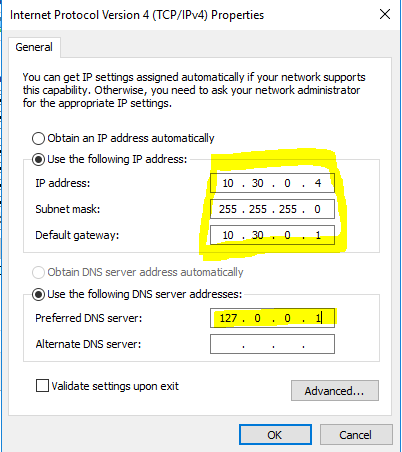
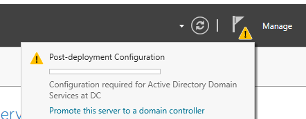
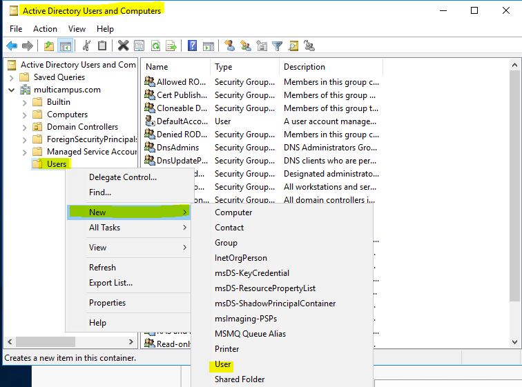
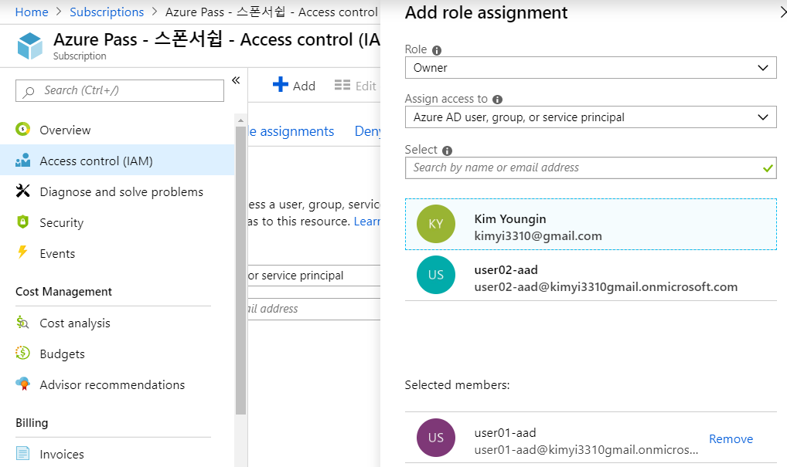
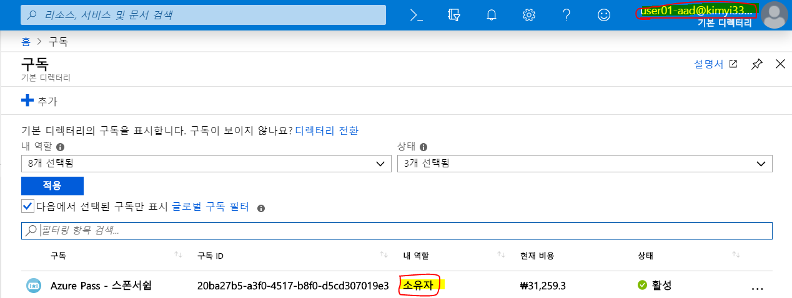
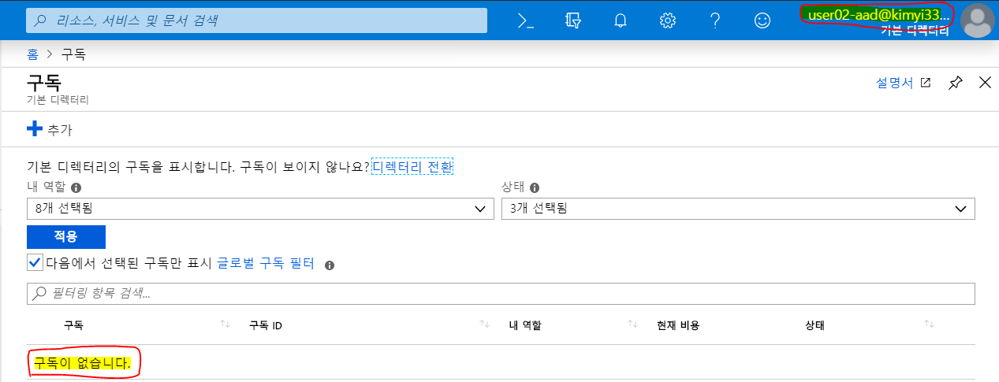
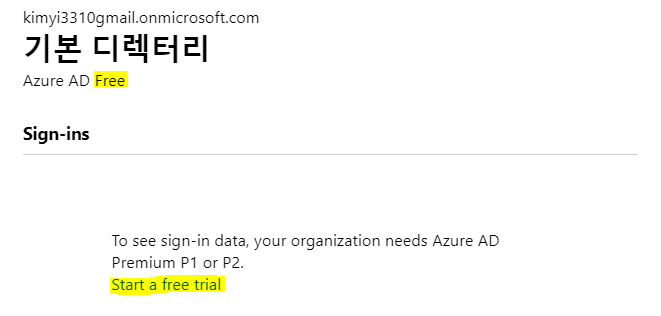

[TOC]

# Concepts of Active Directory

## 1. Active Directory

- MS의 디렉토리 서비스

- 중앙화된 보안관리를 할 수 있습니다.

- GPO를 이용하여 중앙화된 관리를 할 수 있습니다.

  

> **디렉토리 서비스**
>
> 객체(계정 또는 그룹; 네트워크의 정보)를 중앙의 디렉토리에 저장해서 공유해서 사용하는 것입니다.
>
> 디렉토리 서비스 표준인 X.500인 구현하기 어려워서 MS에서 필요한 내용만 남긴 것이 AD입니다.

​	

## 2. Domain

- 보안의 논리적인 범위
- 도메인 환경을 구현하기 위해서는 Domain Controller가 필요합니다.
- 중앙화된 관리
- SSO (Single Sign On)
- 계정과 그룹을 DC에서만 만들고, 그것을 네트워크에 있는 컴퓨터들이 공유하여 사용합니다.

> **DC (Domain Controller)**
>
> 도메인 환경의 보안 관리하는 시스템 (Active Directory 설치)

## 3. WorkGroup

- 각자 시스템이 보안을 관리하는 환경. 중앙화된 관리가 안됩니다.

- 기업의 시스템이 20대 미만인 소규모 환경에서 사용합니다.

- 자신의 시스템의 SAM 인증 (위치 : C:\Windows\System32\config)

- 인증이 완료되면 토큰이 발생합니다.

- 단점 : 접근할 때 마다 그 컴퓨터에 인증을 받아야합니다.

  

> **토큰에는**
>
> ​		User SID : 유저
>
> ​		Member Group SIDs : 유저가 포함된 그룹
>
> ​		Privileges("user rights") : 부여된 권한
>
> ​		Other access information : 접근 정보

> **SID (Security ID)**
>
> 사용자 계정, 그룹, 컴퓨터 계정 등 각각의 계정에게 부여된 숫자로된 고유번호.
>
> Administrator (사람이 인식) <==> 숫자로된 고유번호 (운영체제가 인식)
>
> 폴더나 파일에는 보안이 할당이 되어있습니다.

## 4. 실습

### 1. Virtual Network 만들기

> Name : vNet-10.30.0.0-16
>
> Address space : 10.30.0.0/16
>
> Resource group : RG-0503-01
>
> Subnet > Address range : 10.30.0.0/24

### 2. VM 두개 만들기

> Resource group : RG-0503-01
>
> Virtual machine name : DC 와 SVR1 (두 개!)
>
> Region : East US
>
> Image : Windows Server 2016 Datacenter
>
> Size : D2s_v3
>
> Public inbound ports : RDP(3389)

### 3. VM에 DNS 설정

kyi-dc.eastus.cloudapp.azure.com

kyi-svr1.eastus.clouldapp.azure.com

> **Active Directory IDA Services**
>
> 1. AD LDS : Active Directory Lightweight Directory Services. AD의 객체 속성의 일부를 가져다줍니다.
>
> 2. AD CS : Active Directory Certificate Services. 인증서를 배포하는 서버
>
> 3. AD RMS : Active Directory Rights Management Services.
>
> 4. AD FS : Active Directory Federation Services. 회사 간의 single sign on 구현을 가능하게 함
>
> 5. AD DS : Active Directory Domain Service. 객체를 담고 있다. 가장 중요.

### 4. DC 만들기

DC는 고정IP를 써야합니다.

#### IP 고정

DC에서

SVR에서

10.30.0.5

255.255.255.0

10.30.0.1

10.30.0.4 <== dc server를 바라보게 해야함.

#### AD DS 설치

Manager > Add roles and features > AD DS 설치

Notification> 'Promote this server to a domain controller'

​			> Add a new forest > Root domain name : multicampus.com

#### DC에서 계정 만들기

Active Directory Users and Computers > Users 오른쪽 버튼 > New > User > user_kim@multicampus.com > next > 암호 > Password never expires 만 체크 > finish

김똘똘 클릭 > 'Members of' > Add > Domain Admins > OK > OK

#### SVR1에서

Local server > WorkGroup 클릭 > Change > Domain : multicampus.com

실행 > firewall.cpl > File and Printer 체크체크체크

#### DC에서

실행 > \\\svr1\c$    ==> DC에서 SVR1의 c드라이브에 접근

mstsc /v: kyi-svr1.eastus.cloudapp.azure.com >  user_kim@multicampus.com 으로 로그인

#### GPO 

**DC에서 SVR1의 제어판을 못 건들이도록 하기**

DC에서 Server Manager > Tools > group policy management

Forest > Domain > multicampus 오른쪽버튼 > Create a GPO ... > Name : Prohibit-control > OK

"Prohibit-control" 오른쪽버튼 > Editor > User Config... > Administrative Templ... > Control Panel > Prohibit Access 더블클릭 > Enable

DC와 SVR1에서 > cmd > gpupdate /force #그룹정책 Refresh

# Azure Active Directory

AAD에서는 GPO나 OU를 사용하지 않습니다.

AAD계정을 만들고 subscription 레벨의 권한을 부여해줍니다.

Owner 권한 : 해당 리소스에 대한 모든 권한을 갖습니다.

권한은 아래로 상속됩니다. Subscription > Resource Group > Resource

RBAC : 리소스를 사용할 수있도록 권한이 부여된 Role 

kimyi3310gmail.onmicrosoft.com  : 기본 디렉토리

## 유저만들기

all users > new user > 

> Name : user01-aad / user02-aad
>
> User name : user01-aad@kimyi3310gmail.onmicrosoft.com
>
> Profile > 똘똘, 김, 과장, IT / 똘순, 김, 부장, IT
>
> Password : Zotu2921 /  Huda6109
>
> ​	==> 내가 부여하는 비밀번호가 아님. 복사해서 메모해두기.

Subscription > Access control (IAM) 

> Autehtication(인증)  : ID와 password를 확인
>
> Authoriztion(허가) : 리소스 접근 권한
>
> ​		서브스크립션 > 리소스 그룹 > 리소스

## 권한을 부여하기

Subscription > 내 Subscription 클릭 > Access control(IAM) > Add < Add Role assignment

## 로그인하여 확인하기

## Multi-Factor Authentication

- 다단계 인증. 한 번 더 인증받도록 하는 것
  - AAD Free, Basic - 지원 안함
  - AAD Premium 1, Premium 2 - 지원함

↓ 한달동안 프리미엄으로 업그레이드 가능

# 실습 (Lab Answer Key: Module 8: Creating and managing Azure AD)