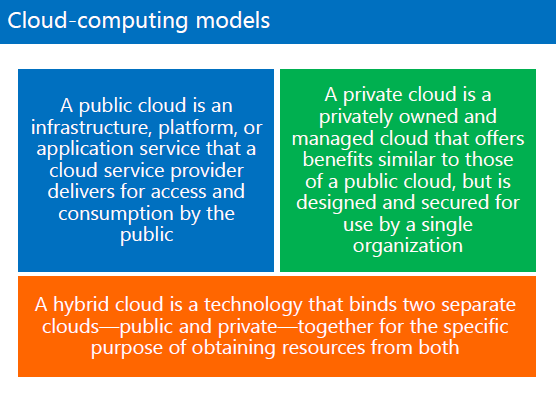

[TOC]

# Module 7 : Intro to containers and serverless computing in Azure

## Introduction

### Software Defined Datacenter

**Software Defined Compute**

​	Compute는 Server를 의미합니다.

​	데이터 센터의 굉장히 많은 하드웨어(서버)들을 풀링하여 관리하는 것.

​	이렇게 굉장히 많은 서버들을 관리하는.

**Software Defined Network**

​	네트워크 장비를 그룹으로 풀링하여 관리하는 것.

**Software Defined Storage**

​	스토리지 장비를 그룹으로 풀링하여 관리하는 것.


**SDD를 구현하는 솔루션**

​	MS

​	- WS Hyper-V

​	- System Center 전체 데이터센터를 관리하는 관리 툴.

​	리눅스

​	- KVM, Openstack 등이 있습니다.

==> 용량이 너무 큽니다.

- 3세대 데이터센터 = 가상화기반 데이터센터 ==> "현재"
- 4세대 데이터센터 = Container 기반 데이터센터 ==> "앞으로 옮겨가는 중"
  - Serverless / VM도 필요없다. 아주 빠르게 확장가능
  - 컨테이너가 Hyper-V라고 생각하고, VM이 없이 런타임과 앱이 바로 올라간다


## Introduction to Containers

두 가지 시나리오가 있습니다.

- (하드웨어 위에 VM 위에 컨테이너 엔진이 있는 경우) 
  - H/W > VM > OS > Container engine > Binaries/libraries > App
- (하드웨어 위에 바로 컨테이너 엔진이 있는 경우)
  - H/W > Container engine > Binaries/libraries > App
  - 성능이 빠름, 확장/축소가 빠름


## Introduction to Docker

각각의 컨테이너에는 IP가 자동으로 할당됩니다. 확장도 자동으로 됩니다.

### 도커의 용어

- **Docker Engine**
  - 컨테이너들이 하드웨어를 공유해서 쓸 수 있도록 하는 커널(OS에서 가장 중요한 것)
  - similar to Hyper-V
- **(Container) Image**
  - 저장소에서 다운받아서 실행을 하면, 메모리로 로드가 되요.
- **Container**
  - Image가 실행된 상태
- **Dockerfile**
  - 도커 명령어를 담고있는 스크립트
  - 도커를 명령어로 실행할 수도 있지만, 파일로 저장해서 사용할 수 있습니다.
- **Docker Registry**
  - Container Image를 담고있는 저장소
  - Docker Hub = 공용 Registry


> 추천 교재 :
>
> ​	도커 - 시작하세요! 도커, 용찬호, 위키북스
>
> ​	쿠버네티스 - Kubernetes in Action, 마르코 룩샤, 에이콘출판사
>
> 도커
>
> 도커허브


### 도커의 명령어

20533교재 7-11 페이지

`docker login` : private registry 에 로그인

`docker pull` : registry에 있는 이미지를 내 컴퓨터로 다운로드

`docker tag` : 버전 정보를 넣을 때. 도커 컨테이너로 이미지를 만들 수 있는데, 여러 버전으로 만들 수 있습니다.

`docker push` : 내 컴퓨터에 있는 이미지를 레지스트리에 업로드

`docker run` : 도커이미지를 실행해서 메모리로 로드. `docker pull` 명령어를 내장.

`docker rmi` : 이미지 삭제

`docker rm` : 컨테이너 삭제


### Docker Compose

20533교재 7-10 페이지

1. Install Docker Compose

2. Create docker-compose.yml

   ​	스크립트라고 생각하면 됨.

3. Run docker-compose up


Container-clustering 서버를 그룹핑 하는 것


### 쿠버네티스

Swarm은 요즘 사용하지 않음.

쿠버네티스의 약어 K8S


## 실습

[20533 Lab Answer Key : Module 7](https://github.com/MicrosoftLearning/20533-ImplementingMicrosoftAzureInfrastructureSolutions/blob/master/Instructions/20533E_LAB_AK_07.md)

가상컴퓨터 '20533E-MIA-CL1' > PowerShell >

```javascript
> add-20533EEnvironment
> ... 7, Y, 4, 12
```


Exercise 2에서 browse to the port 8080 하는 법:

​	"[http://l0720533eq5lpfhkt4dbuq.eastus.cloudapp.azure.com:8080](http://l0720533eq5lpfhkt4dbuq.eastus.cloudapp.azure.com:8080/)" :8080을 붙인다.


# 시험문제(30문제)


On-demand의 단점: 장소, 장비(서버, 스토리지, 네트워크, 회선, UPS(항온, 항습)), 소프트웨어 구매, 보안관리, 개발비용




Public cloud가 무엇이냐, Private cloud가 무엇이냐, Hybrid cloud가 무엇이냐

> Public : AWS(Amazon), Azure(MS), GCP(Google)
>
> Private : VMWare(Dell)
>
> Hybrid : Azure(Stack)


설명이 맞는 것은? 틀린것은? 2개 골라라, 3개 골라라.

공유폴더 > Iaas,Paas,Saas


명령어

```javascript
> ipconfig /all #TCP/IP 확인, host 이름도 나와요
> gpedit.msc # 시스템의 로컬정책을 확인.
> ncpa.cpl # 네트워크 세팅창을 띄움.
> #외우지는 않아도 됨
> netstat -an # 내 컴퓨터와 연결된 컴퓨터가 무엇인지, 열려있는 포트가 무엇인지 확인.
```

Subnet Mask 값은 왜 필요한가? 네트워크주소와 호스트 주소를 식별하기 위해

게이트웨이 값은 왜 필요한가? 외부 네트워크와 통신하기 위해

DNS 서버 아이피는 왜 필요한가? FQDN(컴퓨터이름+도메인이름)을 IP로 바꾸기 위해


방화벽 세팅 = 주관식 포함 3문제

**원격접속할 때 열어야할 포트**

윈도우서버 (TCP 3389)

SQL (TCP 1433)

MySQL (TCP 3306)

리눅스 (TCP 22)


**WebApp 은 이아스인가요 파스인가요**

**VM을 만들면 사설아이피가 들어가나요 공인아이피가 들어가나요?** 사설아이피

​	10.10.0.0/24 Azure에서 1,2,3까지 예약되어있다. 0번과 255는 안돼. 즉, 4번~ 254까지

​	서브넷 갯수 251=256-5개

**애저에서 서브넷팅 최소로 나눌 수 있는 것?** 29비트까지


**AAD**

**MFA (Multi-Factor Authentication) : 다단계인증**

​	아이디와 패스워드를 넣었을 때, 해킹 방지를 위해 한 번 더 물어봄.

​	이것을 구현하기 위한 요구사항 : Subscription이 Premium1, Premium2 이어야 한다.


**ARM (Azure Resource Manager)**

​	classic 환경 : 옛날에 vm을 배포할 때는 서비스 이것저것이 한꺼번에 배포가 되요.

​		tag를 지원하나요? No

​		rbac 지원하나요? yes, but 제한된 지원

​		템플릿 배포 가능한가요? 

​			Github에 jason 형식

​	ARM 환경 : 서비스 이것저것이 분리가 되어 배포가 되요.

​		태그를 지원하나요? yest

​		rbac 지원하나요? Yes, 전체를 지원

​		템플릿 배포 가능한가요?]


Availability 가 뭔가요?

vm이 한 개가 fail 나더라도, 다른 vm을 사용할 수 있도록 해주는 것

Availability set

 fault domain은 맥시멈 3개까지, update domain 은 20개 까지

 fault domain이 뭔가요? fault가 났을 때 복제를 몇개까지 하냐

update domain : 한 번에 update해서 리부팅하는 컴퓨터


**Load Balancer와 Traffic manager**

**Load Balalncer**

Layer 4: TCP, UDP  ==> 포트에 대해서 컨트롤

**Traffic manager**

Layer 7: http, dns, smtp


P2S (Point to Site) : 각 개별 컴퓨터에서 Azure VM과 연결

S2S (Site to Site) : 관리자가 라우터와 Azure VM과 연결

ExpressRoute : 회사네트워크를 Azure와 다이렉트로 연결

VNet-to-VNet = 다른 데이터센터 간 연결

VNet peering = 같은 데이터센터 내의 VNet끼리 연결

**VPN이란?**

터널링 기술 4가지 프로토콜

​	PPTP, L2TP, SSTP, IKEv2


**NAT란?**


PowerShell 

**Az 모듈 설치 순서!**

(설치>임포트)>커넥트>서브스크립션가져오고>세팅하고 

() == 클라우드셸에서는 생략가능


**사설아이피대역!**


**호스트가 50개일 때, 서브넷마스크를 몇개를 할당해야할까요**

도커

**Docker Compose가 뭔가요?** 도커를 배포할 때 스크립트로 만들어서 여러개의 이미지를 한꺼번애 배포.

**docker-compose.yml**  도커이미지를 정의한 파일.

**docker-compose up**


**쿠버네티스에서 컨테이너를 배포하는 단위가 뭔가요? POD (=컨테이너들의 묶음)**

swarm 은 쿠버네티스와 같은 역할인데, 옛날꺼.

**레지스트리는 뭔가요?**  도커 이미지 저장소

​	퍼블릭 이미지는 도커 허브에 있습니다.

​	프라이빗 이미지는 Azure Registry service 이용하여 이미지를 custumize 할 수있어요.


**도커 명령어**

docker push 업로드

docker pull 다운로드

docker run == docker pull + 실행