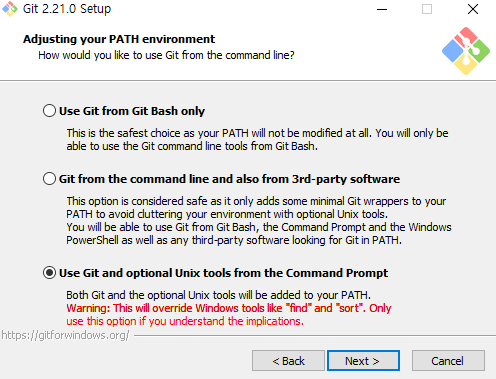

김탁희 님의 특강

[TOC]

# Recommendation

- 수업
  - Coursera
  - Edx-CS50
  - Udacity
  - K-MOOC

- youtube
  - Siraj Raval
  - python gta 5 :: 자율주행자동차를 gta에서 


- 모두를 위한 머신러닝/딥러닝 강의

- 코딩테스트 대비
  - 백준 : 문제의 양이 굉장히 많아서, 문제의 질이 왔다갔다 합니다.
  - 프로그래머스
  - HackerRank : 단계 별로 풀어볼 수 있습니다.

# Github

## Github 설치

>  Github은 분산형버전관리시스템(DVCS)이다.
>
> 소스코드의 이력이 기록된다.

1. 다운로드 "git bash for windows" 



2. 가입하기 "Github.com"

3. 데스크탑에 'TIL' 폴더 생성

4. 그 폴더에서 오른쪽 클릭 > 'git bash here ' 클릭


## 기본명령어

### 1. git 저장소(repository) 초기화

```bash
$ git init
Initialized empty Git repository in C:/Users/user/Desktop/TIL/.git/

user@DESKTOP-5SRVCVE MINGW64 ~/Desktop/TIL (master)
```

- 달러표시는 커맨드나 파워셸 등에서 입력하라는 뜻이다.

- 원하는 폴더를 저장소로 만들게 되면, `git bash` 에서는 (master)라고 표기된다.

- 그리고 숨김폴더로 `.git/`이 생성된다.

### 2. 커밋할 목록에 담기(Staging area)

```bash
$ git add .
```

- 현재작업공간(Working directory/Tree)의 변경사항을 커밋할 목록에 추가한다.

- . <- 리눅스에서 현재 디렉토리(폴더)를 표기하는 방법으로, 지금 내 폴더에 있는 파일의 변경사항을 전부 추가한다는 뜻이다.

- 만일 특정 파일만을 추가하려면, `git add 파일명.확장자`로 추가할 수 있다.

- 만일 특정 폴더를 추가하려면, `git add myfolder/`로 폴더 내의 모든 파일을 추가할 수 있다.

### 3. 커밋하기

```bash
$ git commit -m "20190521"
$ git config --global user.email "kimyi3310@gmail.com"
$ git config --global user.name "kimyi33"
$ git commit -m "20190521"
```

- 커밋을 할 때에는 해당하는 버전의 이력을 의미하는 메세지를 반드시 적어준다.

- 메세지는 지금 버전을 쉽게 이해할 수 있도록 작성한다.

- 커밋은 현재 코드의 상태를 스냅샷 찍는 것이다.

### 4. 로그 확인하기

```bash
$ git log
```

- 현재까지 커밋된 이력을 모두 확인할 수 있다.

### 5. git 상태 확인하기

```bash
$ git status
```


## 원격 저장소 활용하기

### 원격저장소(remote repository) 등록하기

```bash
$ git remote add origin ___경로___
```

- 원격 저장소(`remote`)를 등록(`add`) 한다. `origin` 이라는 이름으로 `경로` 를!
- 최초에 한번만 등록하면 된다.
- 아래의 명령어로 현재 등록된 원격 저장소를 확인할 수 있다.

```bash
$ git remote -v
```

### 원격 저장소에 올리기( push)

```bash
$ git push origin master
```

- `git`! 올려줘(`push`) `origin`이라는 이름의 원격저장소에 `master`로!


### 원격 저장소 복제(Clone) 하기

```bash
$ git clone ___경로___
```

- 다운 받기를 원하는 폴더에서 `git bash` 를 열고 위의 명령어를 입력한다.
- 경로는 `github`에서 우측에 있는 초록색 버튼을 누르면 나타난다.

### 원격 저장소 가져오기

```bash
$ git pull origin master
```

### 주의!!

반드시 작업한 뒤에 `git push origin master` 하기!!

반드시 작업하기 전에 `git pull origin master`  하기!!